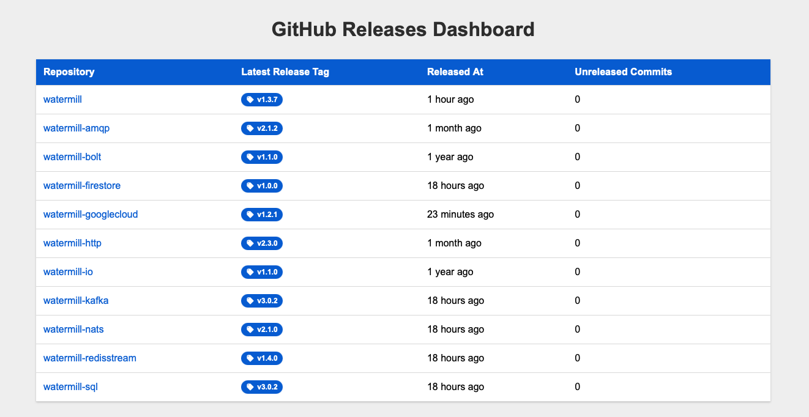

# github-releases-dashboard

A simple dashboard to keep track of GitHub releases.



## Running

```bash
go run github.com/ThreeDotsLabs/github-releases-dashboard@latest
```

## Configuration

The dashboard is configured using environment variables:

- `PORT` — defaults to `8080`.
- `GITHUB_TOKEN` (optional) — Use to increase rate limits.
- `REPOS` — a comma-separated list of repositories to track with optional branch name after a color (defaults to `main`). For example, `ThreeDotsLabs/github-releases-dashboard:master,ThreeDotsLabs/watermill:master`.
- `REFRESH_INTERVAL` — how often to refresh the data, defaults to `1h`.
